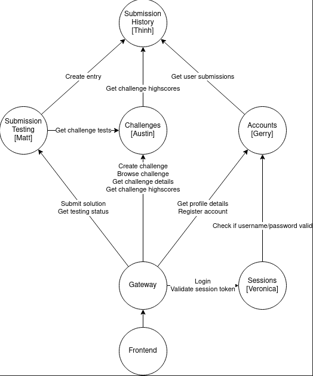

# CS497Project

## Team members and their corresponding microservice:
* Matthew Oslan - [Submission Testing](https://github.com/jitli98/CS497Project/tree/master/submission-testing)
* Gerry Gan - [Accounts](https://github.com/jitli98/CS497Project/tree/master/IdentityManagement), [Gateway](https://github.com/jitli98/CS497Project/tree/master/Gateway)
* Austin Pinto - [Challenges](https://github.com/jitli98/CS497Project/tree/master/challenges)
* Thinh Pham - [Submission History](https://github.com/jitli98/CS497Project/tree/master/submission-history)
* Veronica Gusev - [Sessions](https://github.com/jitli98/CS497Project/tree/master/sessions)


## System design



This application consists of 5 different micro-services which are **Accounts**, **Submission Testing**, **Submission History**, **Challenges** and **Sessions**. The directory for each micro-service contains the source code and documentation to run each service independently if one chooses to do so. The documentation also contains information about various endpoints that each microservice has. All of our microservices communicate with one another using regular HTTP protocol. In addition, each and every microservice (including the **Gateway**) runs in its own Docker container to create a sandboxed environement for ease of developement and they are all managed with Docker Compose. The **Gateway** acts as a reverse-proxy that directs HTTP requests from the client(Frontend) to the appropriate micro-service and it serves the purpose of decoupling the client interface from underlying microservice backend. It also controls access to the underlying services by making sure that the client has a valid JWT token when making request to secured endpoints. 

We mostly used the [official Docker documentation](https://docs.docker.com/get-started/) as a reference point for our development and also sought advice from Matt who had considerable past experience in using Docker. We decided to pursue the utiliziation of an NGINX Web Server as the **Gateway** after reading about the perks of doing so on a [Nginx blog](https://www.nginx.com/blog/building-microservices-using-an-api-gateway/).

## Scalability

As of now, our current Docker Compose implementation allows for the deployment of multiple instances of a container and it can be done so by running: `docker-compose up --scale submission-testing=3` to create 3 instances/containers of the submission-testing service. Following the above example, when a HTTP request is made to the `http://submission-tesing/` , the underlying DNS server in Docker will use a round robin implementation to distribute the incoming request to any of the 3 submission-testing containers that were deployed. 

We are also currently in the process of learning a container orchestration technology - specifically Swarm - that will allow us to deploy and control containers across multiple virtual machines. If time persists, we would wish to be able to run our entire microservice architecture with Docker Swarm which would allow us to achieve higher levels of scalability.

## Links for each individual video presentation
* [Gerry Gan](https://youtu.be/Sl-UmJx18_U)
* [Veronica Gusev]()
* [Thinh Pham]()
* [Matthew Oslan]()
* [Austin Pinto]()


## Running all microserviecs together 

Prerequisites: [docker](https://docs.docker.com/engine/install/) and [docker-compose](https://docs.docker.com/compose/install/)

1. Checkout files with `git clone https://github.com/jitli98/CS497Project.git && cd CS497Project`

2. Build and run all services with `docker-compose up --build`

3. The URLs of each micro-service: \
    Accounts:
    ```
     http://localhost:8080/account/
    ```
    Challenges:
    ```
     http://localhost:8080/challenges/
    ```
    Sessions:
    ```
     http://localhost:8080/sessions/
    ```
    Submission Testing:
    ```
     http://localhost:8080/submission-testing/
    ```
    Submission History:
    ```
     http://localhost:8080/submission-history/
    ```

<hr>

### To perform a CLEAN restart of Docker Instances:
1. Stop the container(s) using the following command:
    ```
    docker-compose down
    ```
2. Delete all containers using the following command:
    ```
    docker rm -f $(docker ps -a -q)
    ``` 
3. Delete all volumes using the following command(Only do this if you intend on removing persistent data stored in volumes):
    ```
    docker volume rm $(docker volume ls -q)
    ``` 
4. Restart the containers using:
    ```
    docker-compose up --build
    ```

